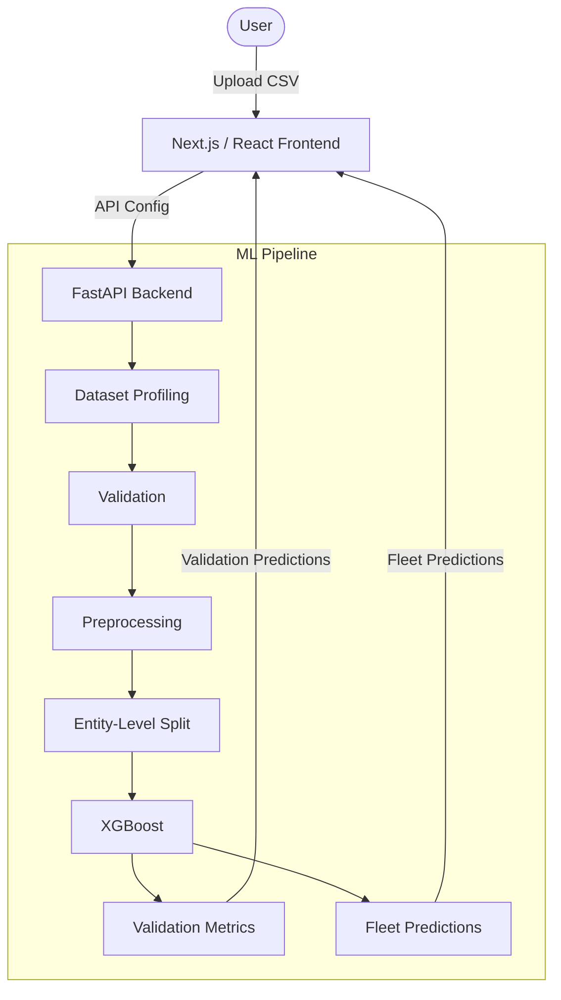

# Predictive Engine

Predictive-maintenance / Remaining Useful Life ML platform.

A configurable predictive-maintenance ML platform that takes industrial sensor data through profiling, validation, leakage-safe entity-level evaluation, model training, and fleet-level prediction visualization.

## Product

Upload industrial sensor data, configure the RUL target, train an XGBoost predictive-maintenance model, evaluate it on unseen machines, and inspect fleet-level health predictions.

---

## Demo / Product Preview

*(Placeholder for future product screenshots. We recommend adding a hero product screenshot, dataset configuration screenshot, and fleet-health screenshot here once available).*

---

## Architecture



---

## ML Methodology

### Dataset Profiling
The system automatically profiles uploaded tabular datasets, detecting entity (machine ID), temporal dimension (time/cycle), target column (e.g., failure event or raw RUL), and all corresponding sensor features.

### Validation
The platform performs strict **Entity-Level Splitting**. Machines/entities are split entirely into train or validation sets, rather than randomly splitting individual rows.
**Why this matters:** The model must be evaluated on machines it did not train on to accurately measure its ability to generalize to new equipment in the field.

### Preprocessing
- **Feature Selection:** Identifies and retains features that correlate with degradation.
- **Operating-Condition Normalization:** Removes variance caused by different operating regimes.
- **Constant-Feature Removal:** Discards sensors with zero variance.
- **Train-only fitting:** All scalers and selectors are fitted *only* on the training split.
- **Validation transform:** The validation data is transformed using the fitted training pipeline.
**No preprocessing is fitted on validation data.**

### Model
**XGBoost Regression.**
XGBoost was selected because it serves as a robust baseline for structured/tabular sensor data, is exceptionally fast to train, provides interpretable feature importance, and is highly appropriate for the project's current dataset structure.

---

## Fleet Prediction Architecture

It is critical to distinguish between two distinct inference flows in the platform:

**VALIDATION PREDICTIONS**
Used exclusively to calculate model performance (RMSE, NASA Score). Generated using the validation split.

**FLEET PREDICTIONS**
Used to visualize the complete fleet after the model has been fitted. Fleet preprocessing uses the already-fitted training transformations to project predictions for all machines simultaneously. This is standard deployment-style visualization, not data leakage.

---

## Results

These experiments demonstrate that the baseline architecture generalizes across progressively more complex C-MAPSS datasets, while also revealing the expected performance degradation under greater operating and fault complexity.

| Dataset | Complexity | Model | RMSE | NASA Score |
|---|---|---|---:|---:|
| FD001 | 1 operating condition / 1 fault mode | XGBoost | 17.90 | 831 |
| FD003 | 2 operating conditions / 1 fault mode | XGBoost | 21.38 | 2,153 |
| FD004 | 6 operating conditions / 2 fault modes | XGBoost | 29.97 | 7,811 |

---

## Dataset Compatibility

The platform is strictly an **RUL regression engine**.

**Valid Schema:**
Entity → Time/Cycle → RUL Target → Features

**Invalid Schemas (Rejected by API guardrails):**
- Classification targets (e.g., binary failure labels).
- Datasets missing a temporal dimension.
- Ambiguous schemas without explicit configuration.

---

## API

The backend exposes a clean REST API:

- `GET /health` - Returns the API health status.
- `POST /profile` - Analyzes an uploaded CSV and returns inferred dataset schema.
- `POST /train` - Initiates an asynchronous training job with the provided configuration.
- `GET /job/{id}` - Polls the status of a specific training job.
- `GET /prediction/{id}` - Retrieves the results, metrics, and predictions for a completed job.

---

## Running Locally

**Prerequisites:**
- Python 3.11.x
- Node.js 24.x

### Backend

Create a `.env` file based on `.env.example`:
```bash
cp .env.example .env
```

Install and run the FastAPI backend:
```bash
python -m venv .venv
# Activate virtual environment
.venv\Scripts\activate
pip install -r pyproject.toml
python -m uvicorn src.api.app:app --host 127.0.0.1 --port 8000
```

### Frontend

Create a `.env.local` file based on `frontend/.env.example`:
```bash
cd frontend
cp .env.example .env.local
```

Install and run the Next.js frontend:
```bash
npm install
npm run dev
```

---

## Testing

The project uses `pytest` for the backend and `vitest` for the frontend. All tests are passing (M20 verified state).

**Backend:**
```bash
python -m pytest -q
```

**Frontend:**
```bash
cd frontend
npm run test
npm run lint
npm run build
```

---

## Repository Structure

- `src/` - FastAPI backend application, routing, and ML pipeline source code.
- `frontend/` - Next.js React frontend, styling, and interactive UI components.
- `tests/` - Backend test suite (API compatibility, pipeline execution, etc.).
- `experiments/` - Documentation of ML experiments and benchmark evaluations.

---

## Engineering Decisions

### Why entity-level splitting?
To avoid evaluating on machines the model has already seen, ensuring real-world deployment accuracy.

### Why XGBoost?
Provides a strong tabular baseline with excellent feature importance interpretation.

### Why FastAPI?
Offers a simple, type-safe, Python-native interface for inference and training.

### Why Next.js/React?
Enables a highly interactive product workflow and dynamic data visualization.

### Why separate validation and fleet predictions?
To maintain strict evaluation integrity while allowing for a comprehensive deployment-style fleet visualization.

---

## Limitations

- **In-memory job registry:** Jobs vanish if the server is restarted.
- **Single-instance architecture:** Localized prototype design.
- **10 MB upload limit:** Prevents in-memory exhaustion.
- **No persistent model registry.**
- **No authentication.**
- **No production monitoring.**
- **RUL-specific contract:** Only supports regression.
- **Public benchmark validation:** Not equivalent to true production validation.

---

## Future Work

- Redis integration
- PostgreSQL database
- Celery/RQ for task queues
- Persistent model registry
- Object storage integration
- Authentication layer
- Experiment tracking
- Production monitoring
- Docker/container deployment
- Cloud deployment
- Support for richer datasets
- Model comparison framework

---

## License

This project is licensed under the MIT License.
