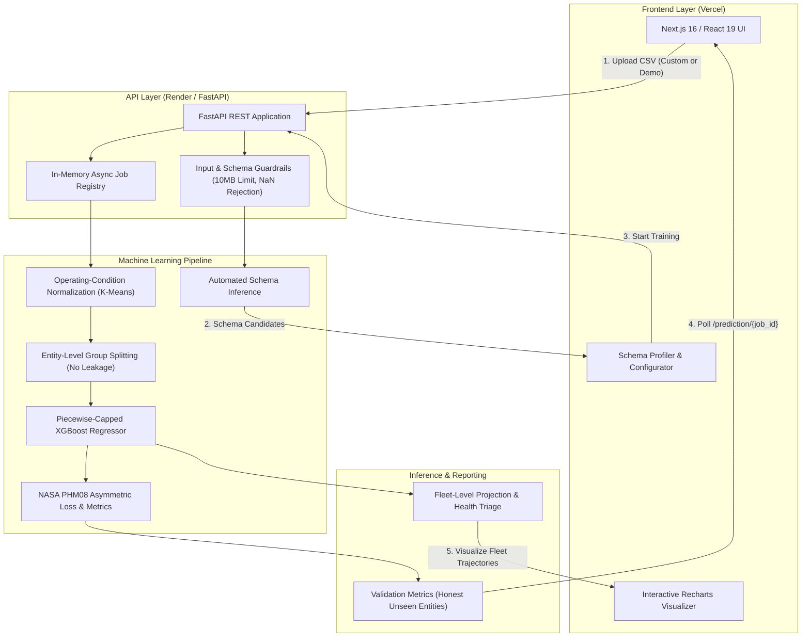

# Predictive Engine

> **AI-Powered Predictive Maintenance & Remaining Useful Life (RUL) Intelligence Platform**

[](https://predictive-engine-rul.vercel.app)
[](https://predictive-engine-rul.onrender.com)
[](https://predictive-engine-rul.onrender.com/docs)
[](tests/)
[](frontend/)

---

## 📌 Executive Summary

**Predictive Engine** is an AI-powered predictive-maintenance platform that converts industrial sensor telemetry into remaining-useful-life (RUL), machine health, and maintenance intelligence.

The long-term target domain is aviation/aerospace and other mission-critical industrial systems. The current implementation is a **deployed and validated predictive-maintenance prototype** evaluated on NASA's C-MAPSS (Commercial Modular Aero-Propulsion System Simulation) benchmark dataset.

The platform provides an end-to-end workflow: from CSV ingestion and automated schema profiling to leakage-safe entity-level evaluation, deterministic XGBoost model training, asymmetric aviation-risk scoring, and interactive fleet-level health prioritization.

* 🚀 **Production Web Application:** [predictive-engine-rul.vercel.app](https://predictive-engine-rul.vercel.app)
* ⚙️ **Production FastAPI Backend:** [predictive-engine-rul.onrender.com](https://predictive-engine-rul.onrender.com)
* 📖 **Interactive Swagger Docs:** [predictive-engine-rul.onrender.com/docs](https://predictive-engine-rul.onrender.com/docs)
* 📂 **GitHub Repository:** [aryan-gaikwad30/predictive-engine-rul](https://github.com/aryan-gaikwad30/predictive-engine-rul)

---

## 📸 Product Preview & System Visuals

| Landing Experience | End-to-End Pipeline Flow |
|:---:|:---:|
|  |  |
| **Landing & Mission-Critical Maintenance Portal** | **Signal to Prediction: Pipeline Architecture** |

| Model Comparison (XGBoost vs Deep Learning) | Engineering Depth & Technology Stack |
|:---:|:---:|
|  |  |
| **Empirical Model Comparison & Metrics** | **Decoupled Architecture & Full Tech Stack** |

<p align="center">
  
  <br />
  <em>System Specification & Repository Architecture</em>
</p>

---

## 🎯 The Industrial Problem: Why Predictive Maintenance Matters

Industrial and aerospace operators face a fundamental maintenance dilemma:

1. **Reactive Maintenance (Run-to-Failure):** Operating equipment until component failure leads to catastrophic secondary damage, emergency operational grounding, severe safety hazards, and exorbitant emergency repair costs.
2. **Static Preventive Maintenance (Time-Based Overhauls):** Replacing components on rigid, conservative operating-hour schedules discards valuable remaining asset life and incurs substantial unnecessary maintenance expenses on healthy parts.
3. **Condition-Based Predictive Maintenance (The Predictive Engine Approach):** By continuously analyzing multi-channel sensor telemetry (temperatures, pressures, spool speeds, bypass ratios), operators forecast the exact degradation trajectory and Remaining Useful Life (RUL), enabling planned maintenance windows right before functional failure occurs.

---

## 🏗️ End-to-End System Architecture

The platform follows a decoupled, production-grade cloud architecture:



---

## ⚙️ Key Engineering Highlights & ML Methodology

### 1. Leakage-Safe Entity-Level Splitting
* **The Pitfall:** Naive random train/test splitting across time-series rows causes severe data leakage because the model trains on intermediate cycles of the same machine it is tested on, yielding artificially inflated metrics.
* **The Solution:** The pipeline enforces strict group-based splitting by entity ID (Engine/Machine ID). Complete degradation lifetimes of unseen units are held out exclusively for validation.

### 2. Operating Condition Normalization (Regime Clustering)
* Turbofan engines operate across distinct flight envelopes (varying altitude, Mach number, and throttle settings).
* The pipeline automatically detects candidate operating condition channels, clusters operational regimes using K-Means fitted **strictly on the training split**, and normalizes sensor variance within each regime to isolate genuine physical degradation from ambient flight regime variations without data leakage.

### 3. Piecewise Linear RUL Target Formulation
* Early in an engine's operational life, sensors show negligible physical degradation. Modeling raw linear RUL from cycle 1 forces the model to fit early sensor noise.
* The engine applies a piecewise linear degradation target with an upper bound cap ($RUL_{cap} \le 125$ cycles), aligning model objectives with real-world physical wear regimes.

### 4. Asymmetric Aviation Risk Scoring (NASA PHM08 Metric)
Standard RMSE treats overestimating and underestimating RUL equally. In mission-critical aerospace maintenance, an **overestimation (late prediction)** is far more dangerous than an **underestimation (early prediction)**:

$$S = \sum_{i=1}^{N} s_i, \quad s_i = \begin{cases} \exp\left(-\frac{d_i}{13}\right) - 1 & \text{if } d_i < 0 \quad (\text{Early Prediction / Safe}) \\ \exp\left(\frac{d_i}{10}\right) - 1 & \text{if } d_i \ge 0 \quad (\text{Late Prediction / Dangerous Failure Risk}) \end{cases}$$

where $d_i = \hat{y}_i - y_i$ (Predicted RUL $-$ Actual RUL).

### 5. Dual-Flow Prediction Architecture
The system cleanly separates two inference paths:
* **Validation Predictions:** Computed exclusively on held-out validation entities to compute unbiased RMSE, MAE, and NASA scores.
* **Fleet Predictions:** Projects remaining life trajectories across all active fleet units using fitted training transformations, categorizing assets into `CRITICAL` ($RUL \le 25$), `WARNING` ($RUL \le 50$), and `HEALTHY` ($RUL > 50$).

---

## 📊 Empirical Validation Results (NASA C-MAPSS)

The baseline deterministic XGBoost pipeline was evaluated across three benchmark datasets of increasing operational complexity:

| Dataset | Operating Conditions | Fault Modes | Training Units | Test Units | RMSE | NASA Score | Key Observations |
|:---|:---:|:---:|:---:|:---:|:---:|:---:|:---|
| **FD001** | 1 (Sea Level) | 1 (HPC Degradation) | 100 | 100 | **17.90** | **831.55** | Strong baseline performance; clean single-condition degradation signal. |
| **FD003** | 2 (Sea Level + High Altitude) | 1 (HPC Degradation) | 100 | 100 | **21.38** | **2,153.93** | Successfully handles regime variation without hyperparameter tuning. |
| **FD004** | 6 (Full Flight Envelope) | 2 (HPC + Fan Degradation)| 249 | 248 | **29.97** | **7,811.21** | Scaled complexity reveals multi-regime error bounds; baseline holds without divergence. |

---

## 🛡️ Production Guardrails & API Contracts

* **File Size & Memory Protection:** Enforced 10 MB payload ceiling (`MAX_UPLOAD_SIZE`) to prevent server memory starvation during synchronous multipart parsing.
* **Schema Validation:** Strict checks for entity ID, monotonic time/cycle indexing, continuous numeric sensor features, and non-empty targets.
* **Target Semantics Contract:** Explicit verification that target semantics match `rul` (rejecting misconfigured binary classification or arbitrary regression targets).
* **Data Integrity Guardrails:** Automatic rejection of missing values ($NaN$/nulls), duplicate entity-timestamp pairs, and constant (zero-variance) sensor channels.
* **Type-Safe Standardized Error Contract:** Consistent JSON error structure across all HTTP failure codes (400, 404, 422, 500):
  ```json
  {
    "detail": {
      "code": "FILE_TOO_LARGE",
      "message": "File size exceeds maximum allowed size (10485760 bytes).",
      "details": null
    }
  }
  ```

---

## 💻 Tech Stack & Infrastructure

| Layer | Technology | Purpose & Rationale |
|---|---|---|
| **Frontend UI** | Next.js 16 (App Router), React 19, TypeScript | High-performance interactive UI with server and client components |
| **Styling & Icons** | Tailwind CSS, Lucide React | Modern dark-mode aesthetic and responsive typography |
| **Visualization** | Recharts | Real-time RUL degradation trajectories, telemetry time series, and error distributions |
| **Backend API** | FastAPI, Uvicorn, Pydantic v2 | High-throughput asynchronous Python REST API with strict type validation |
| **Machine Learning**| XGBoost, Scikit-learn, Pandas, NumPy | Leakage-safe tabular preprocessing, clustering, regression, and asymmetric scoring |
| **Testing** | Pytest (Backend, 158 tests), Vitest (Frontend, 4 tests) | Comprehensive unit, integration, and API contract test coverage |
| **Hosting** | Vercel (Frontend), Render (FastAPI Backend) | Zero-maintenance decoupled cloud deployment with automated CI/CD |

---

## 📡 REST API Reference

| Method | Endpoint | Description |
|---|---|---|
| `GET` | `/health` | Service health status, version verification, and uptime check. |
| `POST` | `/profile` | Ingests a CSV and returns inferred entity, time, target, feature, and condition columns. |
| `POST` | `/train` | Initiates asynchronous model training with user-configured schema parameters. |
| `GET` | `/job/{job_id}` | Polls the current state of an execution job (`pending`, `running`, `completed`, `failed`). |
| `GET` | `/prediction/{job_id}` | Retrieves validation metrics, feature importance, fleet predictions, and diagnostics. |

---

## 🚀 Local Development & Reproduction

### Prerequisites
* Python 3.11+
* Node.js 20+

### 1. Backend Setup
```bash
# Clone the repository
git clone https://github.com/aryan-gaikwad30/predictive-engine-rul.git
cd predictive-engine-rul

# Create and activate virtual environment
python -m venv .venv
# On Windows:
.venv\Scripts\activate
# On Linux/macOS:
# source .venv/bin/activate

# Install dependencies
pip install -r requirements.txt
pip install -e .

# Configure environment variables
cp .env.example .env

# Run FastAPI backend
python -m uvicorn src.api.app:app --host 127.0.0.1 --port 8000 --reload
```

### 2. Frontend Setup
```bash
cd frontend

# Install npm dependencies
npm install

# Configure environment variables
cp .env.example .env.local

# Start Next.js development server
npm run dev
```
Open [http://localhost:3000](http://localhost:3000) in your browser.

---

## 🧪 Test Suite

Run backend test suite:
```bash
# 158 tests covering API, guardrails, normalization, RUL calculation, and modeling
python -m pytest -q
```

Run frontend test suite and build verification:
```bash
cd frontend
npm run test     # Vitest unit tests
npm run lint     # ESLint code hygiene
npm run build    # Next.js production compilation
```

---

## ⚠️ Known Limitations & Architectural Boundaries

In the spirit of technical honesty and engineering rigor:
1. **In-Memory Job Registry:** Jobs and results reside in active server memory. A container restart or redeploy on Render clears historical job states.
2. **Simulated Benchmark Data:** Validated on the NASA C-MAPSS numerical simulation rather than live physical turbofan sensor feeds.
3. **Tabular RUL Focus:** Designed strictly for multi-sensor RUL regression; it does not process unstructured acoustic audio logs or raw binary failure classification.
4. **Single-Node Execution:** Model training executes synchronously on the backend worker; massive multi-gigabyte datasets require distributed task workers (e.g., Celery/Redis).

---

## 🗺️ Future Roadmap

- [ ] **Distributed Job Architecture:** Redis message broker with Celery/RQ workers for asynchronous background execution.
- [ ] **Persistent Storage & Model Registry:** PostgreSQL for job persistence; AWS S3 / Cloud Storage with MLflow for model artifact versioning.
- [ ] **Deep Learning Sequence Models:** Integrated PyTorch CNN-LSTM / Temporal Convolutional Network (TCN) models for complex temporal dynamics.
- [ ] **Real-Time Telemetry Streaming:** WebSocket & Apache Kafka integration for real-time inflight anomaly and degradation streaming.
- [ ] **Explainability Suite:** SHAP / TreeSHAP waterfall plots for cycle-by-cycle sensor attribution.

---

## 📄 License

This project is licensed under the [MIT License](LICENSE).
