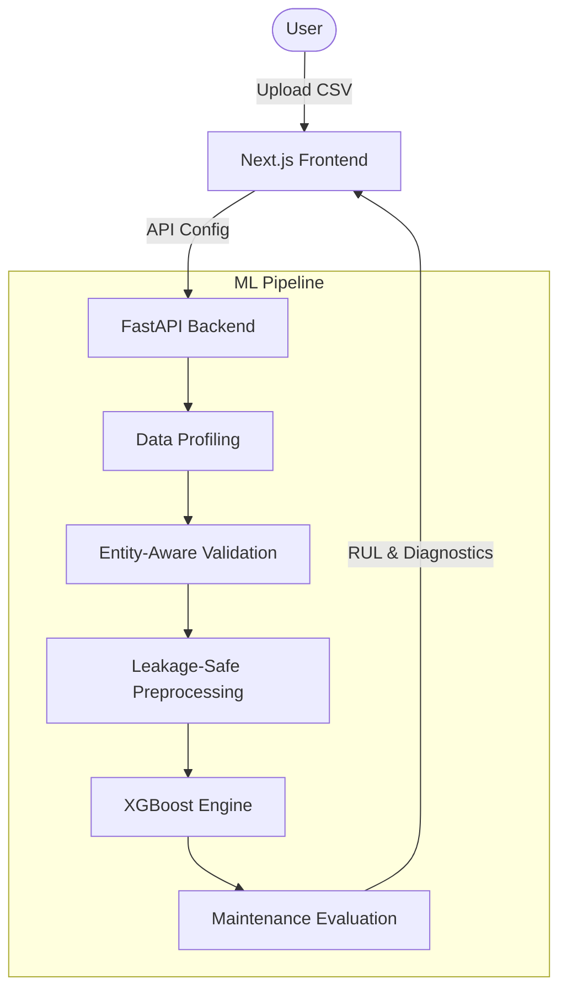

# Predictive Engine — RUL Platform

**Predictive Engine** is a configurable predictive-maintenance ML platform prototype. It takes industrial tabular data through automated profiling, leakage-safe preprocessing, deterministic XGBoost training, evaluation, and machine-level degradation prediction.

The system empowers industrial organizations to transition from reactive maintenance to intelligent **Condition-Based Maintenance (CBM)** by predicting the Remaining Useful Life (RUL) of their equipment.

### High-Level Workflow
```text
CSV → PROFILE → VALIDATE → TRAIN → PREDICT → MAINTENANCE INSIGHT
```

## Architecture



## Key Engineering Features
- **Custom Dataset Profiling:** Automatically detects entity, time, target, and operating conditions.
- **Entity-Aware Validation:** Ensures no temporal leakage across machine lifecycles.
- **Leakage-Safe Preprocessing:** Normalizes operating conditions using strictly `fit` training parameters.
- **XGBoost Baseline:** Highly scalable gradient boosting tree for deterministic regression.
- **Machine-Level Diagnostics:** Detailed unit-level metrics (RMSE, MAE, NASA PHM08 Penalty).
- **FastAPI Backend:** Robust, type-safe API with standard error contracts.
- **React/Next.js Product Frontend:** Premium, commercial-grade product interface.

## Scientific Story
This platform was initially benchmarked against the **NASA C-MAPSS FD001** turbofan degradation dataset. 
In our early experiments on this single-fault, single-condition dataset, the gradient-boosted tree (**XGBoost**) significantly outperformed neural-network approaches (**1D-CNN** and **LSTM**) in both training efficiency and deterministic error metrics.

As a result, XGBoost was selected as the foundational ML engine for custom industrial tabular datasets.

### Real-World Generalization (M20 Update)
To prove the architecture's real-world viability, the baseline pipeline was evaluated on complex, unseen NASA datasets (**FD003** and **FD004**) containing multiple operating conditions and fault modes. The pipeline successfully generalized to these harder datasets *without any architectural modifications*, maintaining strong predictive baseline performance:

| Dataset | Complexity | Model | RMSE | NASA Score |
|---|---|---|---|---|
| **FD001 (Demo)** | Low (1 Cond, 1 Fault) | XGBoost | 17.90 | 831 |
| **FD003 (Eval)** | Medium (2 Cond, 1 Fault)| XGBoost | 21.38 | 2,153 |
| **FD004 (Eval)** | High (6 Cond, 2 Fault) | XGBoost | 29.97 | 7,811 |

*For full experimental details, see `experiments/README.md`.*

## Setup Instructions

### Prerequisites
- **Python 3.11+**
- **Node.js 24+**

### 1. Backend (FastAPI + XGBoost)
```bash
# 1. Create a virtual environment
python -m venv .venv
# Activate it:
# Windows: .venv\Scripts\activate
# Unix: source .venv/bin/activate

# 2. Install dependencies
pip install -r pyproject.toml # Note: You can install via pip install -e .

# 3. Environment configuration
cp .env.example .env

# 4. Start the backend
python -m uvicorn src.api.app:app --reload
```
The API documentation (Swagger UI) will be accessible at `http://127.0.0.1:8000/docs`.

### 2. Frontend (Next.js)
```bash
# 1. Navigate to the frontend directory
cd frontend

# 2. Environment configuration
cp .env.example .env.local

# 3. Install dependencies
npm install

# 4. Start the frontend
npm run dev
```
The frontend will be accessible at `http://localhost:3000`.

## Demo Workflow
1. Start both the backend and frontend.
2. Open `http://localhost:3000` in your browser.
3. Scroll down and click **TRY DEMO DATASET** to auto-upload the included synthetic industrial dataset (`public/demo_dataset.csv`).
4. Review the auto-detected schema (Entity, Time, Target). Ensure Target Semantics is set to `rul`.
5. Click **Train Model**.
6. Inspect the resulting RUL predictions, prediction horizon thresholds, and feature importance!

## Limitations
- **Job Registry:** The API currently uses an in-memory dictionary for job state tracking. Submitted training jobs will vanish if the server is restarted.
- **Single Node:** This is a localized prototype. It does not employ a database, Celery, or Redis.
- **Upload Restrictions:** File uploads are limited in size (default 10MB) to prevent in-memory exhaustion.
