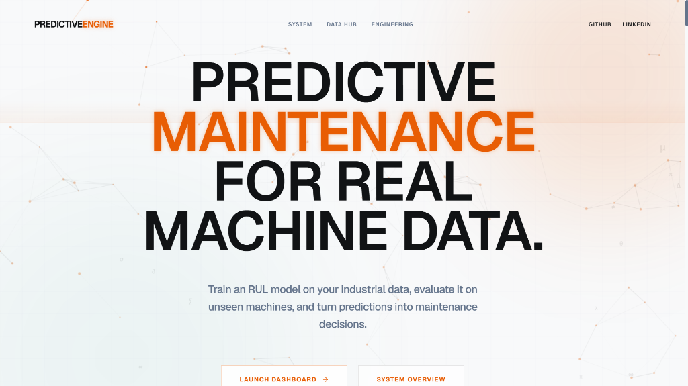
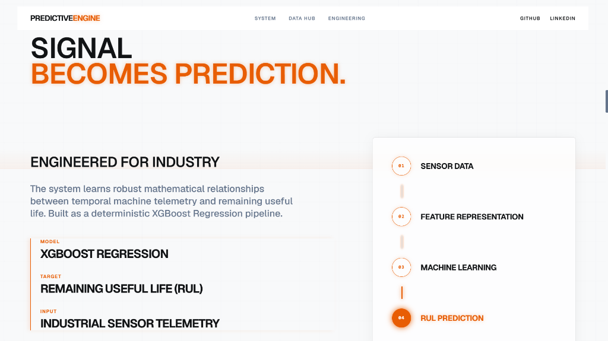
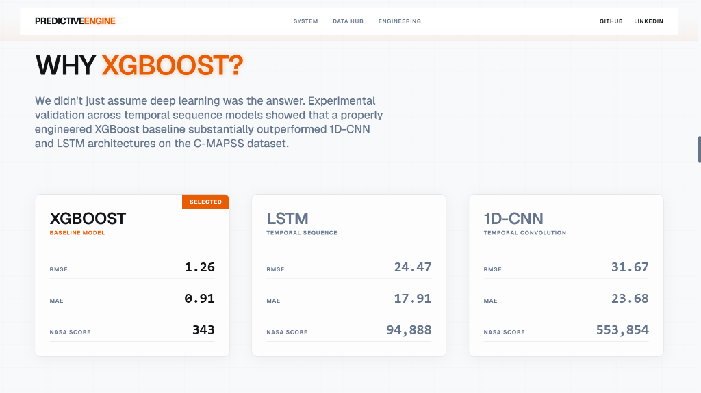
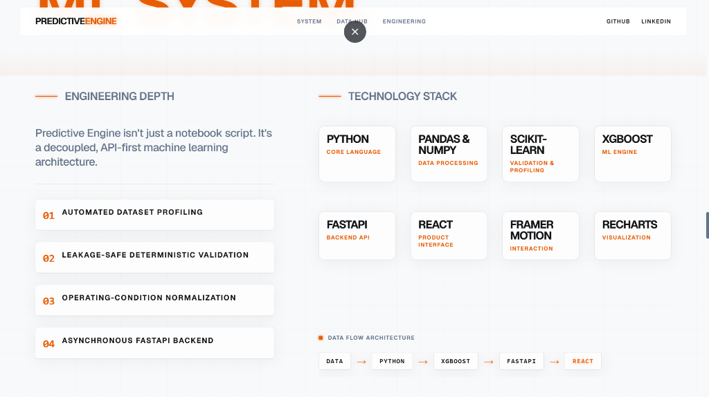
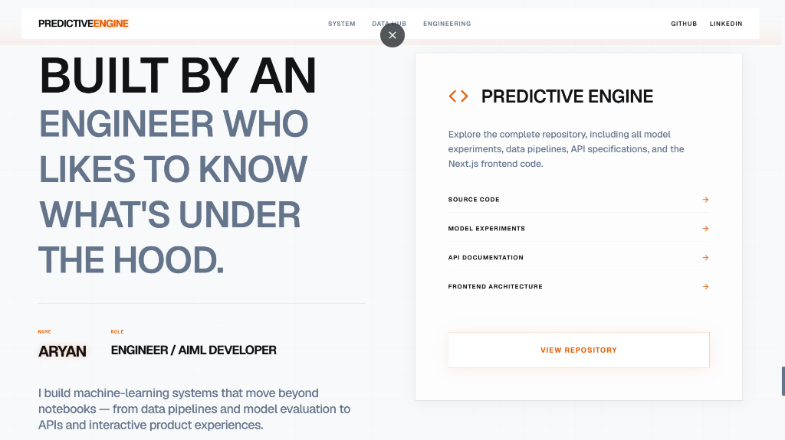

# Predictive Engine — Application Screenshots

This directory contains high-resolution production interface screenshots captured from the live deployment ([predictive-engine-rul.vercel.app](https://predictive-engine-rul.vercel.app)).

---

## 📸 Screenshots Gallery

### 1. Landing & Mission-Critical Maintenance Portal
> *Hero landing interface introducing the condition-based predictive maintenance platform with direct navigation to dashboard execution and system overviews.*

---

### 2. Signal to Prediction: Pipeline Architecture & Data Flow
> *Visual representation of the end-to-end data transformation pipeline: converting temporal sensor telemetry through feature representation into RUL predictions.*

---

### 3. Model Selection & Benchmark Validation (XGBoost vs. Deep Learning)
> *Empirical model comparison demonstrating why a deterministic XGBoost pipeline with regime normalization outperforms complex 1D-CNN and LSTM architectures on the C-MAPSS dataset.*

---

### 4. Engineering Depth & Decoupled Technology Stack
> *Overview of the modular, API-first architecture spanning automated schema profiling, leakage-safe validation, operating-condition normalization, and the full tech stack.*

---

### 5. System Specification & Repository Architecture
> *Developer and engineering overview detailing the open-source codebase, model experiment logs, API contracts, and frontend implementation.*

